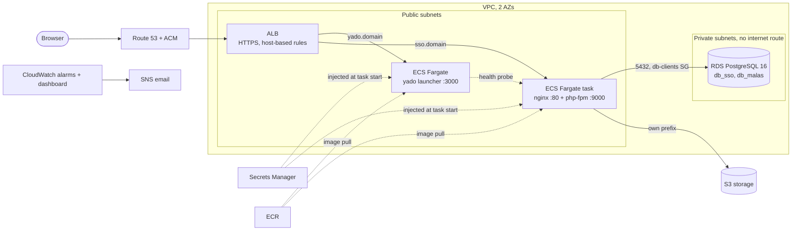

# Architecture

## Overview

`malas` and its queue worker are planned for a later phase. They reuse the
same `ecs-service` module and the same RDS instance.

## From the homelab to AWS

| Homelab | AWS | Why |
|---|---|---|
| Cloudflare Tunnel with a per-hostname table | Route 53 + ACM + ALB host rules | Same idea: one entry point, route by hostname. The ALB also does health-based routing |
| `docker compose up -d` per project | One ECS service per app | The scheduler replaces failed tasks, which a plain restart policy cannot do across host problems |
| php-fpm + nginx as two compose services | Two containers in one Fargate task | Containers in a task share localhost, so nginx proxies to `127.0.0.1:9000` |
| `sso_public` named volume | Ephemeral task volume | Same sharing between php-fpm and nginx, lost when the task stops, which matches how the entrypoint rebuilds it on each start |
| Three Postgres containers | One RDS instance, one database and role per service | Fewer things to back up, patch and monitor |
| `.env` files on the server | Secrets Manager | Not stored on disks, injected at task start |
| Local storage volumes | S3 bucket, per-service prefix | Survives task replacement, versioned |

## Decisions and tradeoffs

**No NAT gateway.** A NAT gateway bills for every hour it exists. Instead the
Fargate tasks are in public subnets with a public IP, and their security group
accepts traffic only from the ALB security group. They still need outbound
access to pull images and reach AWS APIs. The cost of this choice is a wider
outbound surface than a private-subnet design; VPC endpoints would be the
middle path. The database is never exposed: it sits in private subnets with no
internet route.

**One shared RDS instance.** The homelab runs one Postgres per service plus an
unused shared one. Consolidating is cheaper and simpler to operate, but it
couples the services: one noisy neighbour or one outage affects both. It is
the right call at this size. The signal to split is sustained CPU or connection
alarms (`monitoring` module) or a service with different recovery needs.

**Per-service database role.** Each service gets its own role that owns its own
database, with `PUBLIC` access revoked. A compromised `sso` credential cannot
read the `malas` database.

**Database bootstrap as a task, not a Terraform provider.** RDS is private, so
a Terraform run from a laptop or CI cannot connect to it. A one-off, idempotent
ECS task (`modules/db-init`) creates roles and databases from inside the VPC.

**Secrets split by type.** Generated database passwords are created in
Terraform and therefore exist in state; state must be encrypted and private.
Application secrets (`APP_KEY`, OAuth client secret, Passport keys) are only
created as empty containers; values are set out of band so they never enter
state or git.

**Immutable image tags.** ECR repositories refuse tag overwrites, so a deploy
is always a new, traceable version and a rollback is a known tag. The
circuit breaker rolls back a deployment that never becomes healthy.

**Build-time configuration in the launcher.** `NEXT_PUBLIC_*` values are baked
into the Next.js bundle at build time, so changing the SSO URL means rebuilding
the image. The pipeline must build one image per environment rather than
promote a single image.

## What this design does not cover

- Autoscaling (a CPU target-tracking policy would be the first addition).
- Cross-region disaster recovery.
- WAF, KMS customer-managed keys, and S3/ALB access logging. See
  `docs/security-scan.md` for each accepted gap.
- `libs` (a long-lived tunnel and agent broker) and `pore` (static demo).
  Neither fits this model without more design work, and `pore` has no backend.
